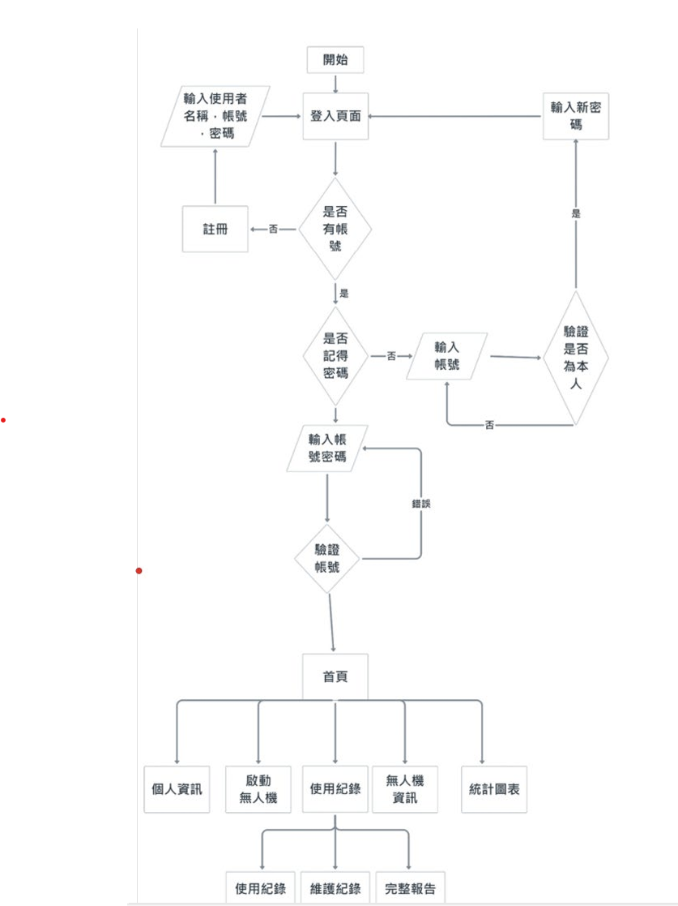
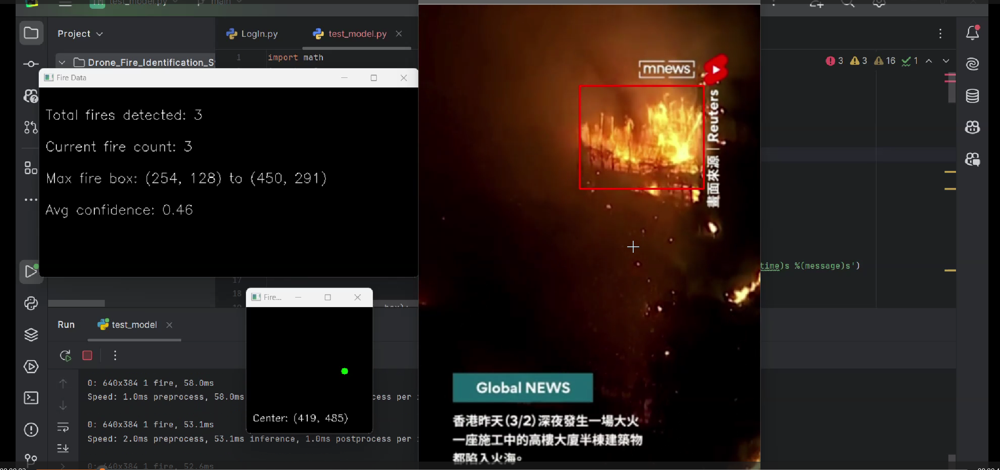
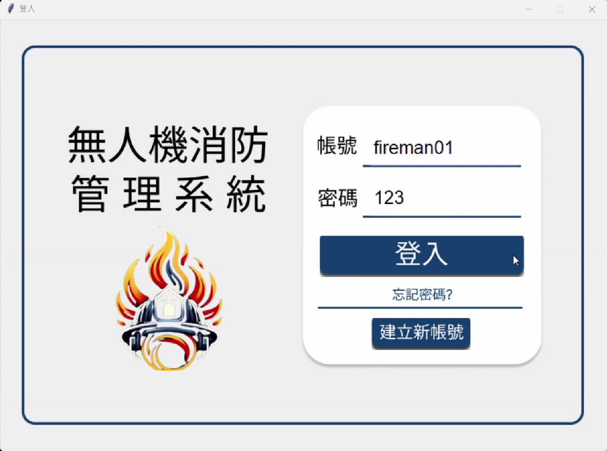
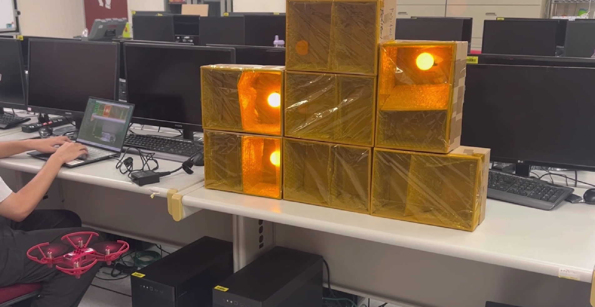

# Drone Fire Identification System  
# 無人機火災辨識系統（畢業專題）

---

## Project Overview
This project develops a UAV-based fire identification system that detects fire from aerial video in real time and provides alerts to support early emergency response.

## 專題概述
本專題建置一套「無人機火災辨識系統」，透過無人機即時影像結合深度學習模型進行火焰辨識，協助提早發現火災並提升救災效率。

---

## Motivation
- Faster fire detection compared to manual reporting  
- Wider coverage than fixed CCTV systems  
- Improved safety using UAV-based monitoring  

## 研究動機
- 相較人工回報，可更快速發現火災  
- 補足固定式監視器視角受限的問題  
- 利用無人機降低消防人員進入高風險區域的需求  

---

## System Architecture
1. UAV captures real-time video streams  
2. Video frames are processed by the fire detection model  
3. Fire confidence and bounding boxes are generated  
4. Alerts are triggered when detection confidence exceeds a threshold  

> Architecture diagram:  
> 

## 系統架構
1. 無人機攝影機取得即時影像  
2. 影像送入火焰辨識模型進行推論  
3. 輸出火焰位置與信心值  
4. 當信心值達門檻時觸發警示機制  

---

## Methods
- Model: YOLOv8-based fire detection model  
- Input: Video frames sampled from live UAV stream  
- Inference: Real-time detection with confidence thresholding  
- Post-processing: Multi-frame validation to reduce false positives  

## 使用方法
- 模型：YOLOv8 火焰辨識模型  
- 輸入：由無人機即時影像擷取之影格  
- 推論：即時辨識並依信心值進行判斷  
- 後處理：透過多幀判斷降低誤判  

---

## Dataset
- Fire and non-fire image samples  
- Dataset preprocessing includes resizing, labeling, and augmentation  
- Dataset split: training / validation / testing  

## 資料集說明
- 包含火焰與非火焰影像資料  
- 進行影像尺寸調整、標註與資料增強  
- 資料分為訓練集、驗證集與測試集  

---

## Experiments & Results
- Evaluation metrics: Accuracy, Precision, Recall  
- Real-time performance measured in FPS  
- Tested under different environments and lighting conditions  

## 實驗結果
- 評估指標：準確率、精確率、召回率  
- 即時性以 FPS 作為效能指標  
- 於不同環境與光照條件下進行測試  

---

## My Contributions
- Designed the overall system architecture  
- Trained a YOLOv8-based fire detection model  
- Designed the database schema and integrated the Line Bot alert system  
- Implemented various functionalities of the graphical user interface (GUI)
 

## 個人貢獻
- 系統整體架構設計    
- YOLOv8 火焰辨識模型訓練  
- 資料庫設計與 Line Bot 警示系統整合
- 使用者介面各項功能製作 

---

## Demo / 示範影片
Click the image below to watch the system demo.

.mp4)

.mp4)

.mov)

## Full project report available in the `report/` directory  

## 完整專題報告請見 `report/` 資料夾 

---

## Limitations & Future Work
- False positives caused by strong light sources  
- Generalization to different environments and cameras  
- Future work includes smoke detection and edge deployment  

## 系統限制與未來展望
- 強光或反射物可能造成誤判  
- 不同環境與鏡頭對模型泛化能力仍有限  
- 未來可加入煙霧辨識與邊緣運算部署  

---

## Project Origin & Versioning
This repository is a personal portfolio version derived from a university team graduation project.  
The original team repository was archived to preserve the final submission state and full commit history.

Original repository:  
https://github.com/tku410630239/Drone_Fire_Identification_System

## 專案來源與版本說明
本儲存庫為個人作品集版本，整理自大學團隊畢業專題成果，  
原始團隊專題儲存庫已於專題結束後歸檔，以保留最終繳交版本與完整 commit 歷史。

原始專題倉庫連結：  
https://github.com/tku410630239/Drone_Fire_Identification_System

